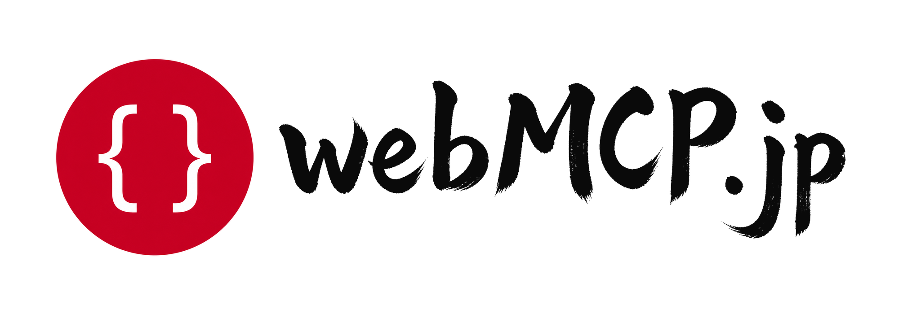

# webmcp-jp



日本語Webアプリ向けの **WebMCP** サンプル・テスト・検証結果・技術文書を公開する非公式OSSです。

> WebMCPは提案中のWeb APIです。仕様とブラウザ実装は変わる可能性があります。W3C正式標準、全主要ブラウザ対応、すべてのAgentが利用できる、といった表現は使いません。

## リポジトリ

| 名前 | 役割 | GitHub |
|---|---|---|
| `webmcp-jp` | このOSS（サンプル・テスト・検証結果・技術文書） | https://github.com/webmcp-jp/webmcp-jp |
| `webmcp-jp-site` | `webmcp.jp` のサイト実装と運用機能 | https://github.com/webmcp-jp/webmcp-jp-site |
| `webmcp.jp` | 公開ドメインとブランド | https://webmcp.jp |

GitHub Organization: [webmcp-jp](https://github.com/webmcp-jp)

## できること

- `document.modelContext` で日本語問い合わせフォームの **下書きTool** を登録する
- 通常のフォームUIを残し、WebMCPがなくても利用できる
- Tool実行だけでは最終送信しない（人が画面で確認して送信）
- Tool登録・日本語入出力・送信前確認・通常UIの自動テストを再実行できる
- 実行環境付きの検証結果を `results/` に残せる

## 含めないもの

- `webmcp.jp` サイト本体、CMS、SEO設定
- GTM、Stripe、課金、顧客管理
- SaaS試作、管理画面、外部SDK配信
- 協会・認証制度の運営
- MCP-B への初期依存（必要なら後から任意比較）

サイト実装は別リポジトリ [`webmcp-jp-site`](https://github.com/webmcp-jp/webmcp-jp-site) で扱います。

## 必要環境

- Node.js **22.13.0以上**
- ブラウザ確認は Chrome のネイティブ WebMCP 実装を優先（実験的）

## 5分で試す

```bash
git clone https://github.com/webmcp-jp/webmcp-jp.git
cd webmcp-jp
npm test
npm start
```

ブラウザで `http://127.0.0.1:4173/examples/contact-form/` を開きます。

1. 氏名・フリガナ・郵便番号・住所・問い合わせ内容・同意を入力する
2. WebMCP対応環境では `draft_contact_form` が登録される
3. Toolやコンソールから下書きを反映しても、**送信は人がボタンを押すまで行われない**

コンソールでの手動下書き例:

```js
await window.__webmcpJpContactForm.executeDraftTool({
  name: "山田 太郎",
  furigana: "ヤマダ タロウ",
  postalCode: "100-0001",
  address: "東京都千代田区1-1",
  message: "資料請求したいです。",
  consent: true,
});
```

## テスト

```bash
npm test
npm run lint
```

| テスト | 内容 |
|---|---|
| Tool登録 | `draft_contact_form` のメタデータと register/unregister |
| 日本語入出力 | 日本語文字列の正規化・往復・部分更新 |
| 送信前確認 | Toolだけでは `submitted` にならない／二重送信防止 |
| 通常UI | HTML構造と、WebMCP APIなしでの検証・送信ゲート |

## ディレクトリ

```
examples/contact-form/   日本語問い合わせフォームのサンプル
tests/                   再現可能な自動テスト
results/                 環境情報付きの検証結果
docs/                    技術基準と利用手順
scripts/serve.mjs        依存ゼロのローカルサーバ
```

## 文書

- [目的と原則](docs/00-vision-and-principles.md)
- [要件](docs/01-product-requirements.md)
- [技術基準](docs/04-webmcp-technical-baseline.md)
- [名前とライセンス](docs/06-domain-and-brand.md)
- [実行計画](docs/07-roadmap.md)
- [決定事項](docs/08-decisions-and-open-questions.md)
- [一次資料](docs/research/source-register.md)
- [検証の書き方](docs/verification.md)

## ライセンス

[Apache License 2.0](LICENSE)

## 参加

[CONTRIBUTING.md](CONTRIBUTING.md) を読んでください。

外部の Issue・コメント・PR の投稿代行は自動では行いません。対象・本文・重複確認・証拠を運営者が確認してから実行します。

## Security

[SECURITY.md](SECURITY.md)

## English (short)

Full English README: [README.en.md](./README.en.md)

`webmcp-jp` is an **unofficial** OSS collection of Japanese WebMCP samples, tests, verification notes, and technical docs.

- Uses current `document.modelContext` (not legacy `navigator.modelContext`)
- One Japanese contact-form sample; the tool only drafts fields
- Final submit stays human-confirmed in the normal UI
- No site CMS, GTM, Stripe, or SaaS code in this repository
- WebMCP is a **proposed** web API; browser support is experimental and may change

```bash
npm test
npm start
```

Open `http://127.0.0.1:4173/examples/contact-form/`.
